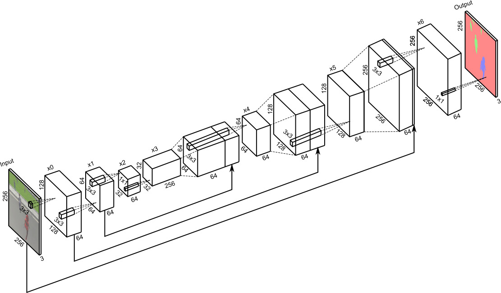
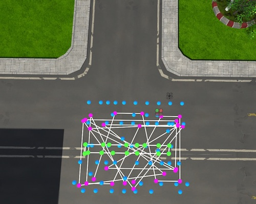
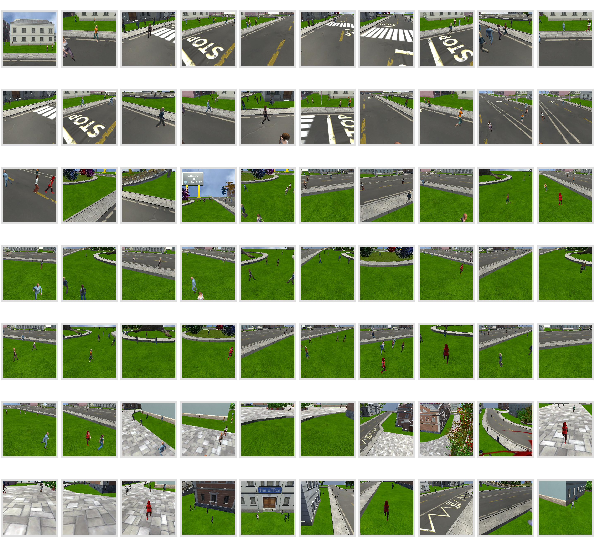
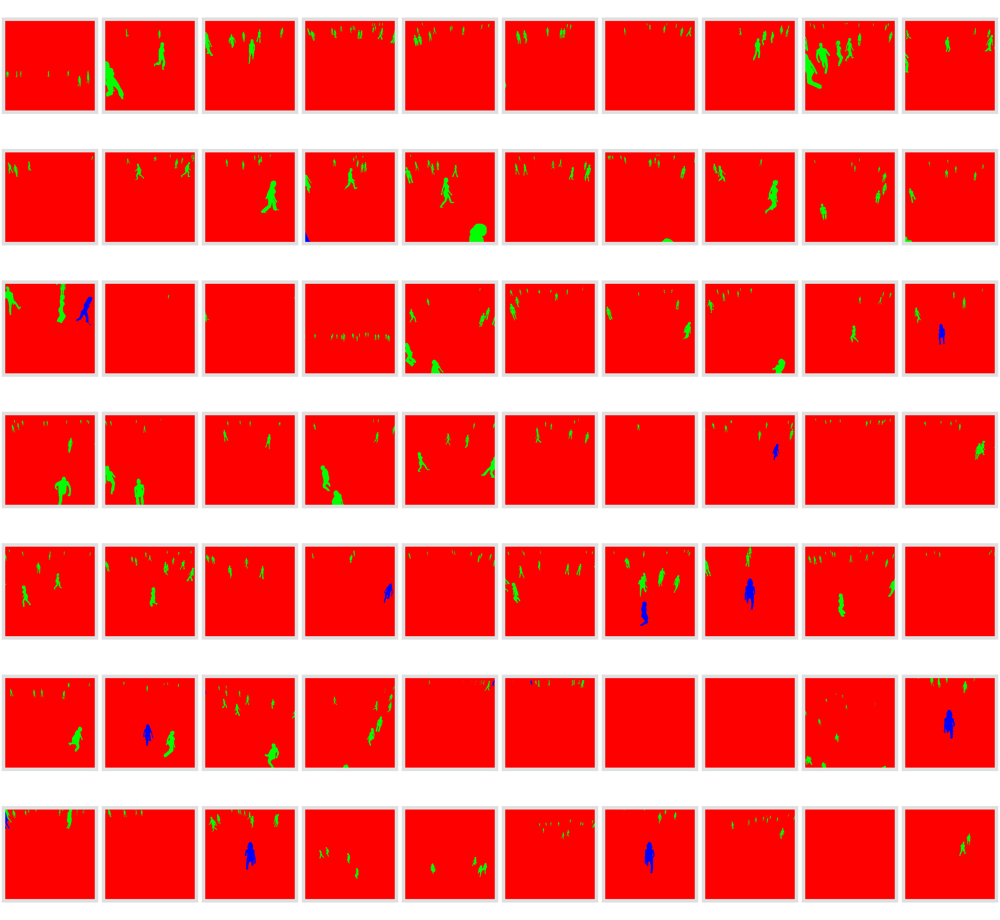
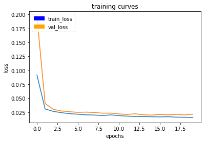
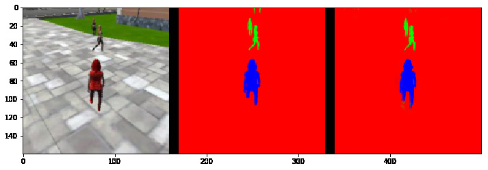
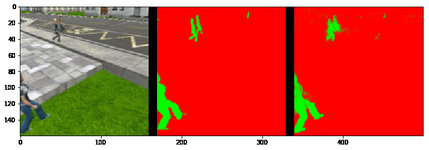
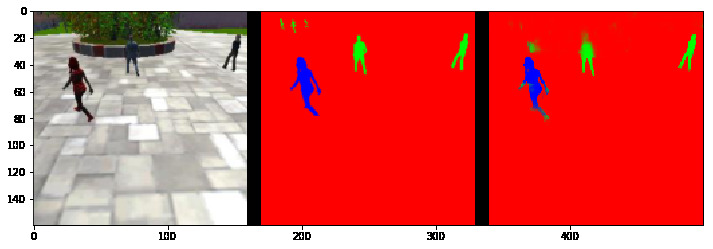

[//]: # (Image References)
[image_0]: ./misc/rover_image.jpg

# Project: Deep Learning

### Network Architecture
The network architecture is shown in the following figure:

A fully convolutional neural network described in the lectures is used for the segmentation task. The network consists of three encoder modules, a 1x1 convolution layer, three decoder modules and a softmax output layer with three channels. Each output channel represents a segmentation class, i.e., hero, people or background. Each encoder module includes a number of convolution maps with separable kernels followed by a batch normalization layer. Each decoder layer consists of bilinear upsampling layer concatenated with the encoder module inputs (skip connections) followed by convolution maps with stride of one.

The 1x1 convolutional layer is used instead of fully-connected layer right after the encoder to preserve spatial information which is needed for a segmentation task while learning semantics similar to a fully-connected layer. The skip connections results in a more fine-grained segmentation comparing to a decoder which only uses heavily downsampled encoder output.

The encoder modules are used to extract features from the input image using the training data, The first layers extract mostly low-level features of the images such as edges, angles etc. while the next layers extracts higher-level features such as body or face parts. The decoder modules are needed to reconstruct the high-resolution segmented output image using the semantics learned by the first layers as well as high-resolution data provided by skip connections.

The characteristics of each layer of the network is listed in the following table:

Name | Depth | Kernel Size | Strides | Separable | Batch Normalized | Activation
:----|:----|:----|:----|:----|:----|:----
input | 3 | - | - | - | - | -
x0 | 64 | 3x3 | 2 | ✓ | ✓ |relu
x1 | 64 | 3x3 | 2 | ✓ | ✓ |relu
x2 | 64 | 3x3 | 2 | ✓ | ✓ |relu
x3 | 256 | 1x1 | 1 | ✗ | ✗ |relu
x4 | 64 | 3x3 | 2 | ✓ | ✗ |relu
x5 | 64 | 3x3 | 2 | ✓ | ✗ |relu
x6 | 64 | 3x3 | 2 | ✓ | ✗ |relu
Output | 3 | 1x1 | 2 | ✗ | ✗ |softmax

The “separable kernel” choice results in a less-complicated network and faster convergence and prevents overfitting to the training data. Also, bilinear upsampling which is used instead of transpose convolution simplifies the network even while it can meet the performance requirement defined for the project.

The network parameters, such as number of layers, depth of each layer and kernel size are chosen by trial and error. If a too small network (few layers or depth per layer) is trained the training and validation losses can not be lowered by any number of epochs of training. On the other hand, a too large network might result in low training loss but the validation loss will have a high variance and the overall performance of the network is not satisfactory. Also a large network might not be fit in the GPU memory or the training will takes a lot of time to complete.

### Data Collection

Training and validation datasets are obtained using "DL Training" mode in the provided QuadSim software. A typical setup for patrol points, path points and spawn points is shown in the following picture:

The data is collected from multiple places on the campus, to train the network with different variety of scene backgrounds. The validation data set is collected in the areas that no training data collected. This way we can reduce the correlation between training and validation data. 20,638 of training images and 6,443 of validation images are collected using the methods described.

Following picture shows samples of training images and the corresponding masks.

Sample Images             | Sample Masks
:-------------------------|:----------------------
   | 

### Training the Deep Network

#### Training Parameters

The training parameters that are used to train the network is listed in the following table:

learning_rate | batch_size | num_epochs | steps_per_epoch | validation_steps | workers 
:---|:---|:---|:---|:---|:---
0.002 | 64 | 20 | 323  | 101  | 4

The methods that are used to set the parameters are described briefly in the following:

**learning_rate**: A very small learning rate results in a slow convergence. Therefore, the learning rate is increased such that the maximum conversion rate can be achieved while the learning curves are smooth and there are no big jumps in it.

**batch_size**: A small batch size results in slow learning and noisy convergence. It is desirable to have larger batch sizes while the training batches fit into GPU memory. However, it has been observed that using a too large batch size might cause some problems in the loss convergence.

**num_epochs**: The learning epochs are continued until there is not much improvement and the performance requirements are met.

**steps_per_epoch**: is the number of training images divided by batch size.

**validation_steps**: is the number of validation images divided by batch size.

**workers**: is set according to the processing platform capabilities.

Following figure shows the learning curve of the training process. It can be seen that training and validation have a similar trend which means the the model is not over-fitting or under-fitting. Also, the validation loss is generally larger than training loss which is expected as the validation data is collected in a different area of the city.

The network weights after training is saved in `data/weights/model_weight.h5' file in HDF5 format.

### Results

Following images show the sample performance of the trained network in different settings. 

#### Sample output while following the target:

#### Sample output while at patrol without target:

#### Sample output while at patrol with target:

The performance metrics calculated in the notebook are as following:

Final IoU: **55%**

Weighted Final IoU: **41%**

### Limitations and Future works

There are some issues with the performance of the trained network. For example, sometimes the network labels the objects with strong edges as people or hero. To resolve this issue, it might be useful to collect negative training data consisting of objects or backgrounds with heavy edges. Also, we might need to change the network architecture as the training data size increases.

A lot of imperfections and variations in a real-world application are not present in the training data. For example, the scene lighting is always the same, while in reality, we can have different levels of lighting. Also, we might have other moving objects such as animals or cars that might be labeled incorrectly by the network. Also, it seems that the network uses the color feature of hero as a main indicator which might cause problems if someone else with similar dress color shows up in front of the camera. Some of these issues can be addressed by collecting more training data of problematic scenarios and a more complex network.

